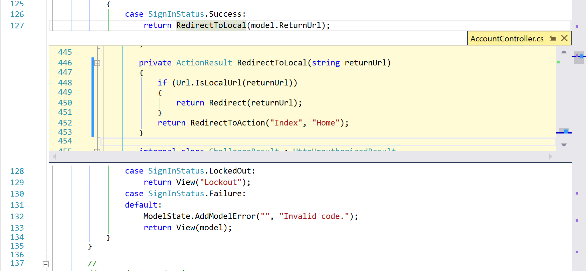
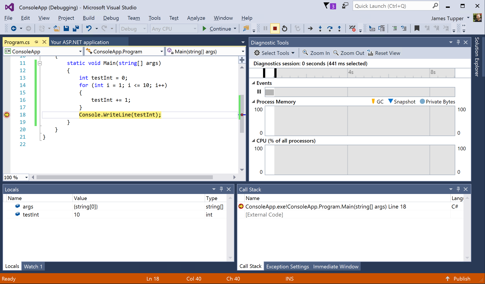

# Visual Studio Community - Getting Started #

This document provides a starting point for new users to get familiar with the Visual Studio Community IDE.

---

## Overview ##

Visual Studio Community is a free, fully-featured, and extensible IDE
for creating modern applications for Windows, Android, and iOS, as well
as web applications and cloud services. This article will walk through
how to start building any kind of application inside of Visual Studio
IDE.

## Contents ##

1. [Requirements](#requirements)
1. [Installing Visual Studio Community](#install)
1. [Open and login to Visual Studio](#login)
1. [Create, build, and run your first project](#create)
1. [Edit your code](#edit)
1. [Debug your application](#debug)
1. [Testing your application](#test)
1. [Visual Studio Extensions](#extensions)
1. [Share code with Visual Studio Team Services and Github](#sharecode)
1. [Conclusion](#conclusion)

---

### Requirements ###

For an up-to-date list of requirements, go to the [Visual Studio 2015 Requirements](https://www.visualstudio.com/en-us/downloads/visual-studio-2015-system-requirements-vs.aspx#1) to view the system requirements for Visual Studio 2015 Community Edition.

---

### Installing Visual Studio Community ###

The Visual Studio Community installer is found [here](https://www.visualstudio.com/post-download-vs?sku=community). This will install all the Visual Studio bits and dependencies.

You will have the opportunity to install the default options, or to customize your install when you first run the Visual Studio installer:

*Visual Studio installer default versus customize*

If you choose **Default**, then Visual Studio 2015 Community will be installed with the default settings.

Otherwise, you will be able to choose which features to install if you choose the **Custom** route.

Once complete, Visual Studio 2015 Community IDE should be installed on your system.

  > **Note :** Full Visual Studio 2015 installation details found[here](https://www.visualstudio.com/post-download-vs?sku=community).

---

### Open and login to Visual Studio ###

Visual Studio is a feature-rich IDE with many integrations into services that further enhance the development experience. By logging into Visual Studio with your Microsoft Account, you connect your IDE to those services and gain access to [Visual Studio Dev Essentials](https://www.visualstudio.com/en-us/products/visual-studio-dev-essentials-vs.aspx). This will let you start using Azure credits, publish code to private repositories, sync your settings, and gain access to all the learning material available through Dev Essentials.

Once Visual Studio IDE has been installed, you will want to open it up and login. This connects you to additional services that require your Microsoft account.

*Login with your Microsoft Account*

Once logged in, Visual Studio will finish up a few configuration steps to make the IDE ready for your use.

  > **Note:** You can always log in at a later time and skip this step.

You will then be brought to the start page of the Visual Studio IDE:

*Visual Studio's start page*

The start page has up-to-date content that will keep you updated on news, link out to external learning resources, and quick links to recent projects and files.

  > **Note:** For more information on the various components of Visual Studio IDE, go to the [Visual Studio IDE documentation page](https://msdn.microsoft.com/en-us/library/dn762121.aspx).

---

### Create, build, and run your first project ###

When you create an app, application, website, Web App, script, plug-in, etc. in Visual Studio, you start with a project. In a logical sense, a project contains of all the source code files, icons, images, data files and anything else that will be compiled into an executable program or web site, or else is needed in order to perform the compilation. A project also contains all the compiler settings and other configuration files that might be needed by various services or components that your program will communicate with.

A project is contained, in a logical sense and in the file system, within a solution, which may contain one or more projects, along with build information, Visual Studio window settings, and any miscellaneous files that aren't associated with any project. In a literal sense, the solution is a text file with its own unique format; it is generally not intended to be edited by hand.

Visual Studio projects can range from their different types (web, desktop, service, etc.) to different languages (C\#, F\#, Python, TypeScript, etc.), but they all use the same Visual Studio IDE features to develop, run, test, and debug each respective project. You can browse all the various types of projects within the New Project wizard, and any project templates that aren't installed will prompt you to download them first.

  > **Note:** For further reading on projects and solutions, go to the [Projects and Solutions in Visual Studio](https://msdn.microsoft.com/en-us/library/b142f8e7.aspx) article.

Clicking on **File / New / Project** will bring up the New Project Wizard.

*Choose a name and then click **OK**

This will build out the folder structure and files, and a starting point for the particular project type. Once finished, it should take you to the **Solution Explorer**, and open the starting code page.

  > **Note:** Some project types need more configuration via wizard page to finish.

*Initial files and structure for new project*

  > **Note:** This project template is an ASP.NET Web Application. For more information on creating Web Applications, go to the [ASP.NET Documentation](https://docs.asp.net/en/latest/) site.

  > **Note:** It is simple to host Web Applications in Azure with the many integrations from Visual Studio IDE. For further reading, go to [Azure Documentation Center](https://azure.microsoft.com/en-us/documentation/).

Notice that all the code files, and dependencies, in the Solution Explorer on the right hand side of the Window.

Because we have a new project, we are going to build it to ensure it can build successfully before we start developing.To do so, click **Build / Build Solution** or **F6**. Then click **View / Output** to open the output window.

*Initial solution build*

In the output window, ensure the output is from **Build**. Notice that the output of the compilation of your project is logged in this windows. The blue status bar at the bottom also shows that the build has succeeded. You will see this bar change color depending on the status of the build (i.e. running, succeeded, failed).

At the top of the screen, there is a green play button - this will launch your application for you and attach the debugger to it.

*Run your application*

**Click the debugger button** to launch your application.

  > **Note**: This is a web application project, so you have the choice to choose from various web browsers - i.e. Microsoft Edge.

*Running web application*

You will see that Visual Studio IDE switches to a debugging view while your application is running. Interact with your application as you see fit, and find the **red, square button** to stop the running application.

*Stop your application*

This will now bring you back to the screen prior to running your application. You have now created a new project in Visual Studio IDE and was able to run and stop it.

  > For further reading on getting started with various types of applications, go to the [Get Started Developing with Visual Studio](https://msdn.microsoft.com/en-us/library/ms165079.aspx) article.

---

### Edit your code ###

Visual Studio excels in aiding developers in writing code, navigating, and fixing issues. From giving you confidence with tools such as Intellisense and auto completiong to navigating through your code without losing context, Visual Studio has a wide range
of features and extensions to add effectiveness and efficiency to developers.

Within your application, **open a code file and start typing anywhere**. You should notice context menus appearing as you type to describe APIs and to help with auto-completion.

*Intellisense in Visual Studio*

You will also notice that there is syntax highlighting which works with 20 languages out of box with Visual Studio (more languages can be supported with extensions) and squiggly lines to point out syntactical problems with your code.

If you want to dive into code you're writing a bit more without losing context, you can use the *Peek to definition* feature by **Right-clicking / Peek Definition** on the method you want, or by pressing **Alt+F12**.

*Peek definition in Visual Studio*

These are just a couple of features that help developers effectively edit their code. Code Lens helps understand changing code, light bulb icons help identify common coding issues, built-in refactoring options or multiple languages, and so on. This lets Visual Studio help its users create the best code they can.

  > **Note:** For further reading on editing code in Visual Studio, visit the [Writing Code in the Code and Text Editor](https://msdn.microsoft.com/en-us/library/efc4xwkb.aspx).

---

### Debug your application ###

The Visual Studio debugger helps you observe the run-time behavior of your program and find problems. The debugger works with all Visual Studio programming languages and their associated libraries. With the debugger, you can break execution of your program to examine your code, examine and edit variables, view registers, see the instructions created from your source code, and view the memory space used by your application.

Paste the following code into an empty Console Application:

     static void Main(string[] args){
          int testInt = 0;
          for (int i = 0; i <= 10; i++){
              testInt += 1;
          }
          Console.WriteLine(testInt);
     }

**Click on the green play button** that says Start, to launch your application. You will note that the window opens and closes before you are able to see the results in the console window.

Let's add a breakpoint on the line where we write to the Console:

*Add a breakpoint where we output to the console*

To add a breakpoint, put your cursor on the same line as the `Console.WriteLine` and click **Debug / New Breakpoint / Function Breakpoint**.

  > **Note:** You can also click in the left margin at the same line, or press F9 to add a breakpoint.

Start debbugging again by clicking the green start button, and you will notice that execution pauses prior to the `Console.WriteLine` code executes.

*Stop at breakpoint*

Execute the selected line of code (click **Debug / Step Over** or **F10**). The curly brace on the next line should now be highlighted in yellow, and the console window should have the value **10** printed in it.

Now lets look at the variable values. Just below the code you should see the **Locals** window which shows the current value of local variables. The window show **testInt** with a value of **10**.

Stop debugging (click **Debug / Stop Debugging** or **SHIFT + F5**).

  > For further reading on debugging, go to the [Debugging in Visual Studio](https://msdn.microsoft.com/en-us/library/sc65sadd.aspx) article.

---

### Testing your application ###

Part of developing an application is making sure that the expected behavior of your code is correct. In Visual Studio, testing has become a forefront of the development experience with it's *Test Explorer* that allows developers to quickly, and easily, write unit tests for theirk code.

It’s called unit testing because you break down the functionality of your program into discrete testable behaviors that you can test as individual units. Visual Studio Test Explorer provides a flexible and efficient way to run your unit tests and view their results in Visual Studio. Visual Studio installs the Microsoft unit testing frameworks for
managed and native code. Use a unit testing framework to create unit tests, run them, and report the results of these tests. Rerun unit tests when you make changes to test that your code is still working correctly. When you use Visual Studio Enterprise, you can run tests automatically after every build.

Unit testing has the greatest effect on the quality of your code when it’s an integral part of your software development workflow. As soon as you write a function or other block of application code, create unit tests that verify the behavior of the code in response to standard, boundary, and incorrect cases of input data, and that check any explicit or implicit assumptions made by the code. With test driven development, you create the unit tests before you write the code, so you use the unit tests as both design documentation and functional specifications.

  > **Note:** For more information on unit testing, visit the [Unit Test Your Code](https://msdn.microsoft.com/en-us/library/dd264975.aspx) article.

The first thing we need to do is add a test project to our solution. To do so, go to **File / New / Project**. On the left side choose **Test** and select the **Unit Test Project**. Click **OK** to create the project.

*Create unit test project*

Once created, you will be presentd with a new unit testing file. Add the following code into the test method:

     // arrange
     var x = 5;
     var y = 7;

     // act
     var sum = x + y;

     // assert
     Assert.AreEqual(12, sum);

You should end up with something that looks like this:

*Add code snippet to unit test method*

Make sure that there are no build errors by building your solution (**Build / Build Solution** or **F6**). After your solution builds successfully, click **Test / Run / All Tests** to build the solution and then run the unit tests.

*Run unit tests*

You will notice that the *Test Explorer* window appears when you do this. This is where the result for automated tests will be shown. Adding test classes and methods are just as easy as writing code, and they are automatically discovered on every build and populated in the Test Explorer.

  > **Note:** for more information on the test explorer, read the [Run unit tests with Test Explorer](https://msdn.microsoft.com/en-us/library/hh270865.aspx) article.

The previous example uses the built-in framework, *MSTest*. It is just as easy to use third-party frameworks (i.e. [NUnit](http://www.nunit.org/) and [xUnit](https://xunit.github.io/)) via extensions. Read [Install third-party unit test
frameworks](https://msdn.microsoft.com/en-us/library/hh598952.aspx) for more information.

  > **Note:** For further information on unit testing, read the [Unit Test Your Code](https://msdn.microsoft.com/en-us/library/dd264975.aspx) article.

---

### Visual Studio Extensions ###

Visual Studio Extensions allow developers to create custom tools,
controls, and templates to help get the most out of Visual Studio IDE.
There are currently thousands of extensions that can help improve your
productivity. These extensions allow you to use different languages,
build applications for mobile devices, enhance your productivity in the
tool, and so on. The possibilities are limitless.

  > **Note:** To browse Visual Studio Extensions, go the the [Visual Studio Gallery](https://visualstudiogallery.msdn.microsoft.com/).

To open the Extensions and Updates window, click **Tools / Extensions and Updates...**. This window gives you the ability to view all the installed extensions, find extensions online, and update any out-of-date extensions.

*Updates and Extensions - Installed*

Let's go ahead and install the [Productivity Power Tools 2015](https://visualstudiogallery.msdn.microsoft.com/34ebc6a2-2777-421d-8914-e29c1dfa7f5d). Click **Online** and then search for **productivity** in the search menu. The first option should be *Productivity Power Tools 2015*, click the **Download** button to install.

*Download Productivity Tools Extension*

Once installed, Visual Studio will notify you that you need to restart the IDE in order for the extension to load. **Restart Visual Studio** for the Productivity Power Tools extension to work.

As you can see, extensions are an easy way to add functionality all over Visual Studio. For further reading on how to extend Visual Studio yourself, check out the [Extensibility in Visual Studio](https://msdn.microsoft.com/en-us/library/dn919654.aspx) article.

  > To browse for current extensions, go to the [Visual Studio Gallery](https://msdn.microsoft.com/en-us/library/dn919654.aspx)

  > To browse open source extensions, go to [Community Extensions](https://github.com/Microsoft/extendvs/blob/master/CommunityExtensions.md) page on Github.

  > You can also check out the [Visual Studio Marketplace](https://marketplace.visualstudio.com/vs) which is coming soon.

---

### Share code with Visual Studio Team Services (VSTS) ###

Very often, developers have the needs to share the code with other developers, back up their code, version their code, build their code, test their code, and so on. Visual Studio IDE has integrations into all of these services in order to enhance and promote team productivity and quality software.

There are a multitude of various ways to this. In this exercise we are going to use [Git](https://git-scm.com/) as the version control and [Visual Studio Team Services
(VSTS)](https://www.visualstudio.com/products/visual-studio-team-services-vs) as the online provider to host the code.

  > **Note:** Here is more reading for [VSTS](https://www.visualstudio.com/products/what-is-visual-studio-online-vs??utm_source=Google&utm_medium=CPC&utm_term=Branded&utm_campaign=VSTS%20EvergreenWT.srch=1&WT.mc_id=SEM_afX2mtl4), [Github](https://github.com/), [Git](https://git-scm.com/), [Azure](https://azure.microsoft.com/en-us/documentation/), and [Devops and Application Lifecycle Management](https://msdn.microsoft.com/en-us/library/fda2bad5.aspx).

Open **Visual Studio Community** and navigate to the *Team Explorer* page which can be opened by **View / Team Explorer**. By default, you will be able to connect and interact with VSTS.

If you don't already have a VSTS account, click the **Get started for free** link to set one up. Then, click the **Connect... / Servers / Add** buttons to add a VSTS account.

*Add a VSTS account*

Once added, you can now choose the *Team Project* that you want and click **Connect** to connect to it. Once connected, you will be able to share your code and interact with all of the other services available in VSTS.

*Connected to a Team Project in VSTS*

  > **Note:** Here is a link to the [Github Extension for Visual Studio](https://visualstudiogallery.msdn.microsoft.com/75be44fb-0794-4391-8865-c3279527e97d)

---

### Conclusion ###

This is a brief intro into some of vast amount of features that Visual Studio has to help developers. Here are some links for further reading:

* [Your First ASP.NET 5 Web App using Visual Studio](https://docs.asp.net/en/latest/tutorials/your-first-aspnet-application.html)
* Create a Universal Windows Platform app - [Create a "Hello, world" app (XAML)](https://msdn.microsoft.com/en-us/windows/uwp/get-started/create-a-hello-world-app-xaml-universal)
* [Build apps with native UI using Xamarin in Visual Studio](https://msdn.microsoft.com/library/dn879698.aspx)
* [Get Started with Visual Studio Tools for Apache Cordova](http://taco.visualstudio.com/en-us/docs/get-started-first-mobile-app/)